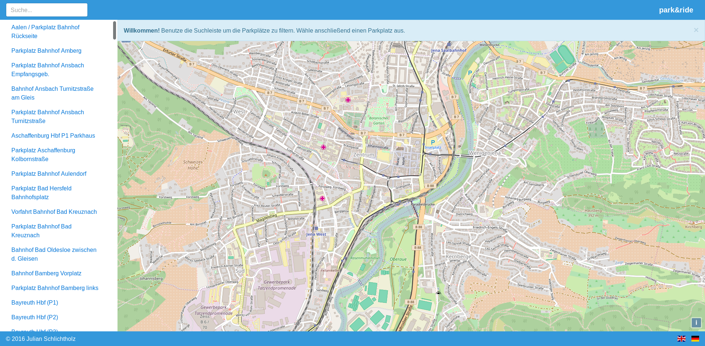
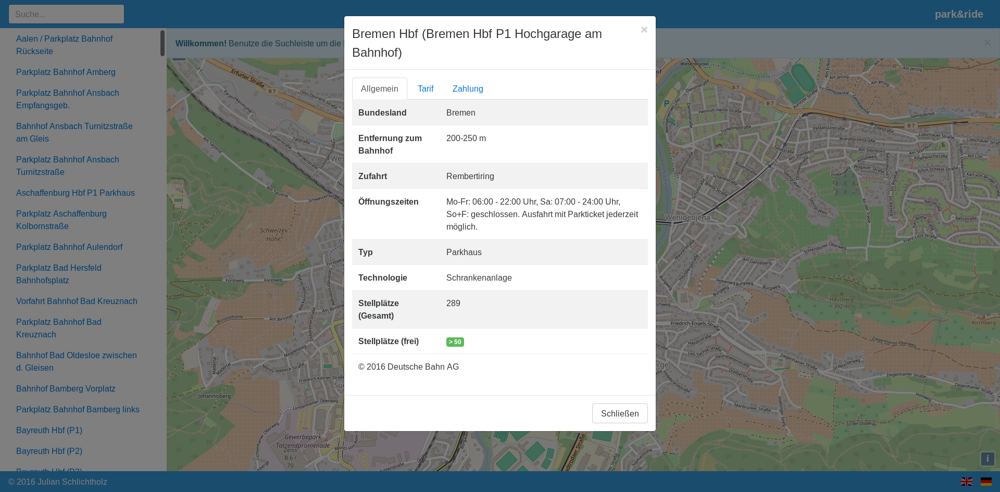

# park&ride
This application has been developed during the 08/2016 code competition by [IT-Talents][1]. The task was to develop a responsive web application which allows to visualize parking ground information.

The following requirements were given: The application
* **MUST** allow search and selection of parking grounds
* **MUST** offer an appealing visualization of available data
* **SHOULD** be easily usable
* **SHOULD** run on modern phones browsers
* **MAY** use the [DB][2] [API][3]

The following user stories were given:
* Where can I find a parking ground?
* How do I find it?
* Are there free parking lots?
* When is the parking ground most crowded? When is it less crowded? (prognosis)

## Development
*This requires `angular-cli` to be installed.*
Run `ng serve` for a dev server. Navigate to [http://localhost:4200/][4]. The app will automatically reload if you change any of the source files.

## Build
*This requires `angular-cli` to be installed.*
Run `ng build` to build the project. The build artifacts will be stored in the `dist/` directory. Use the `-prod` flag for a production build.

## Docker
Run

    docker build . -t jschlichtholz/park
    docker run --name park -p 80:80 jschlichtholz/park

and visit [http://localhost/][5].

[1]: https://www.it-talents.de/
[2]: http://data.deutschebahn.com/
[3]: http://data.deutschebahn.com/dataset/api-parkplatz
[4]: http://localhost:4200/
[5]: http://localhost/
